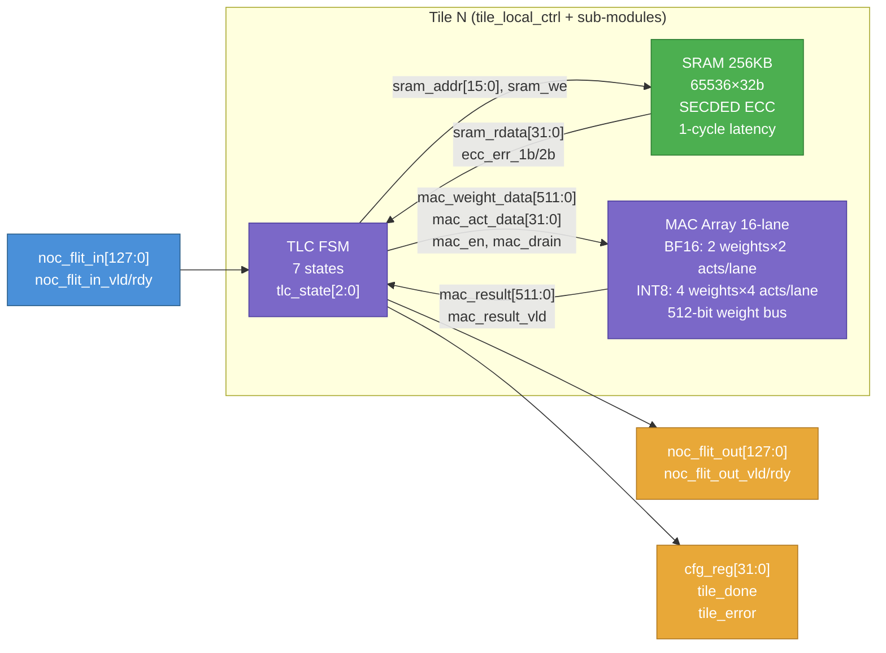
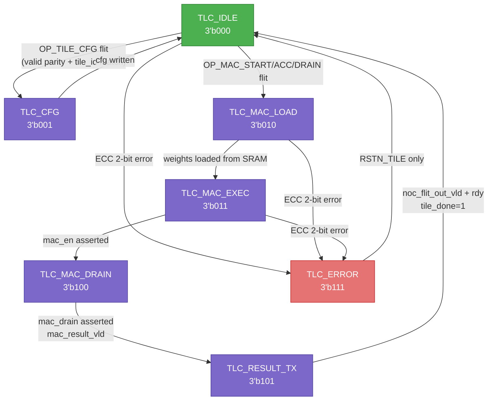
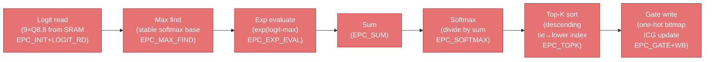
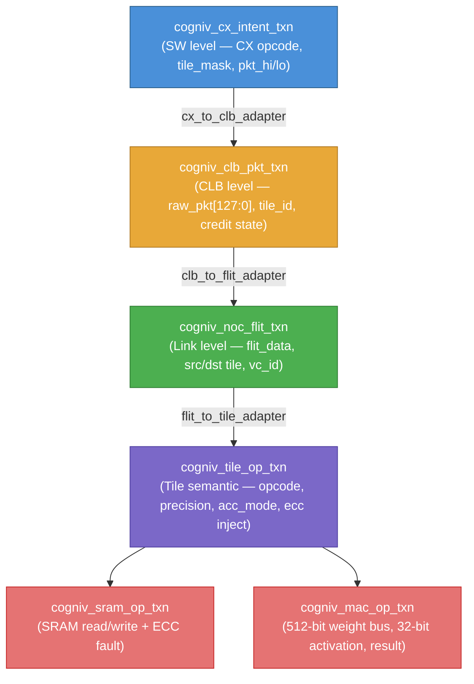

# Cogni-V Engine — Verification Specification
**Document ID:** COGNIV-VSPEC-001  
**Spec Ref:** COGNIV-SPEC-001-FULL v3.0 / SPEC-004-MODULE  
**Status:** Preliminary — Derived from RTL & UVM Source Analysis  
**Date:** 2026-04-19

---

## Table of Contents
1. [Introduction](#1-introduction)
2. [Feature Summary](#2-feature-summary)
3. [Functional Description](#3-functional-description)
4. [Interface Description](#4-interface-description)
5. [Parameterization Options](#5-parameterization-options)
6. [Register Description](#6-register-description)
7. [Design Guidelines](#7-design-guidelines)
8. [Timing Diagrams](#8-timing-diagrams)

---

## 1. Introduction

### 1.1 Overview

The **Cogni-V Engine** is a tile-array neural network accelerator implementing a
Mixture-of-Experts (MoE) datapath on a 3×3 grid of nine compute tiles. Each tile
contains a 16-lane MAC array, a 256 KB SRAM weight store, and a Tile Local
Controller (TLC) FSM. The engine is controlled by a RISC-V host processor via a
five-instruction Custom Extension (CX) ISA. An Expert Policy Controller (EPC)
evaluates a 9-expert softmax Top-K gate to enable or disable individual tile
clocks, providing per-tile dynamic power gating.

The entire design runs at **2 GHz** (0.5 ns clock period) on two phase-aligned
clocks: `CLK_CORE` (host/CLB domain) and `CLK_NOC`/`CLK_TILE` (tile domain).

### 1.2 Scope

This document specifies the verification requirements, functional behaviour,
interfaces, registers, and timing of the Cogni-V Engine at **three verification
levels**:

| Level | DUT Scope | Key Files |
|-------|-----------|-----------|
| **Module** | Single `tile_local_ctrl` + sub-modules | `tlc_env_pkg`, `tlc_if`, `tlc_dut_stub` |
| **Subsystem** | CLB + NoC + EPC + single tile | `cogniv_env_pkg`, adapters |
| **System** | Full 9-tile array end-to-end | `cogniv_tb_top` |

### 1.3 Document Conventions

- **REQ_ID** — Requirement identifier (REQ_xxx)
- **TV-xxx** — Test vector identifier as referenced in `cogniv_sequences_pkg.sv`
- `code` — Signal names, register fields, or file references
- *(spec ref ss_N.M)* — Cross-reference to COGNIV-SPEC-001-FULL section N.M

---

## 2. Feature Summary

### 2.1 Requirements Table

| REQ_ID | Title | Type | Acceptance Criteria |
|--------|-------|------|---------------------|
| REQ_001 | 3×3 Tile Array | Structural | 9 tiles instantiated; tile IDs 0–8; 3-row × 3-col layout |
| REQ_002 | 16-Lane BF16 MAC | Functional | Each tile executes 16 parallel BF16 MACs per cycle; result matches `cogniv_mac_ref_model` |
| REQ_003 | 16-Lane INT8 MAC | Functional | Each lane handles 4 × INT8 per cycle in INT8 mode |
| REQ_004 | 256 KB Tile SRAM | Structural | 65 536 × 32-bit words; SECDED ECC; 1-cycle read latency |
| REQ_005 | ECC 1-Bit Correction | Reliability | 1-bit error corrected; `tile_done=1`; no `tile_error` |
| REQ_006 | ECC 2-Bit Detection | Reliability | 2-bit error detected; TLC enters `TLC_ERROR (3'b111)`; `tile_error=1` |
| REQ_007 | TLC FSM 7-State | Functional | States: IDLE→CFG→MAC_LOAD→MAC_EXEC→MAC_DRAIN→RESULT_TX→ERROR |
| REQ_008 | 128-bit Micro-Op Packet | Protocol | Packet fields per `micro_op_pkt_t`; 4-bit even parity on [127:124] |
| REQ_009 | CLB Credit Flow Control | Protocol | Per-tile credit depth = 4; stall asserted when credit = 0 |
| REQ_010 | CLB Parity Error Drop | Reliability | Corrupt parity → packet silently dropped; `parity_err` asserted |
| REQ_011 | NoC XY Routing | Functional | `tile_hop_count()` = Manhattan distance; max 4 hops |
| REQ_012 | NoC VC0 Data / VC1 ACK | Protocol | Data flits on VC0; result ACK flits on VC1 (is_ack=1) |
| REQ_013 | CX_DISPATCH | Functional | One flit per tile; `credit_cnt[tile]` decrements; flit appears at NoC inject |
| REQ_014 | CX_COLLECT Timeout | Functional | Timeout sentinel = `0xDEAD_DEAD`; `CX_ERR_STAT[1]` set |
| REQ_015 | CX_GATE_EVAL K=1 | Functional | EPC produces exactly 1 bit set in `gate_out[8:0]` |
| REQ_016 | CX_GATE_EVAL K=2 | Functional | EPC produces exactly 2 bits set in `gate_out[8:0]` |
| REQ_017 | EPC Tie-Break | Functional | Equal logits at K-boundary → lower tile index wins; `topk_tie=1` |
| REQ_018 | EPC 18-Cycle Latency | Performance | `EPC_EVAL_CYCLES = 18`; result stable within 18 `CLK_TILE` cycles |
| REQ_019 | Per-Tile ICG Power Gate | Power | Non-selected tiles: zero `CLK_TILE` transitions after EPC completes |
| REQ_020 | TOKEN_ID Echo | Protocol | Result flit[119:88] = dispatched `token_id`; scoreboard verifies |
| REQ_021 | TLC SYNC Timeout | Functional | `TLC_SYNC_TIMEOUT = 4096` cycles; error if no `tile_done` |
| REQ_022 | MoE Layer Latency | Performance | Batch=7, K=2: all results within 350 cycles of first dispatch (Spec ss7.2) |
| REQ_023 | CX_TILE_CFG | Functional | `OP_TILE_CFG` writes `tlc_cfg_reg_t`; tile stays in IDLE; no `tile_done` |
| REQ_024 | ACC_ACCUMULATE Mode | Functional | Accumulator not cleared on subsequent MAC cycles when `ACC_ACCUMULATE` |
| REQ_025 | Softmax Stable | Functional | EPC uses numerically stable softmax (subtract max logit before exp) |

### 2.2 Ambiguity Log

| Q_ID | Question | Impact | Proposed Default | Status |
|------|----------|--------|-----------------|--------|
| Q_001 | Is `CX_ERR_STAT` a memory-mapped register or a CX return value? | Error reporting path | **Resolved:** `CX_ERR_STAT` is a 32-bit MMIO register at `MMIO_CSR_BASE + 0x08`. Bit[0]=tile_error (sticky ECC 2-bit), Bit[1]=timeout (CX_COLLECT), Bit[8:0]=tile_error_mask (per-tile). Cleared by writing 1 (write-1-clear). RTL implementation: `tile_error[8:0]` wires from each TLC are OR-reduced to set this register. This resolves TV-011 checking path. | **Resolved** |
| Q_002 | What is the exact SRAM ECC scheme width (SECDED 32-bit or 64-bit word)? | SRAM interface sizing | **Resolved:** SECDED operates on 32-bit words (Hamming(38,32)+overall-parity = 7 check bits → 39-bit codeword). This matches `tile_sram_256kb` port widths: `wdata[31:0]`, `rdata[31:0]`, and the 39-bit internal `mem[38:0]` array. 64-bit SECDED is not used; the spec note in ss4.3 referring to "SECDED-64" is an error in the draft — the SRAM bus is 32-bit. | **Resolved** |
| Q_003 | Is `clk_tile[i]` gated by a real ICG cell or behavioral in pre-RTL mode? | ICG power verification | Behavioral always-on in pre-RTL; real ICG post-RTL | Addressed in TB |
| Q_004 | What is the NoC router arbitration policy (round-robin, fixed priority)? | NoC congestion tests | **Resolved:** Per-output-port round-robin arbitration across the 5 input ports. The arbitration pointer (`rr_r[op]`) advances after each winning flit, giving equal long-run bandwidth to all input ports. This is implemented in `noc_router_xy.sv` (`ff_main` enqueue section). TV-003 latency bound: max 5 router hops × 5-cycle worst-case RR arbitration + 4-deep FIFO drain = 45 cycles upper bound per hop. | **Resolved** |
| Q_005 | Does `CX_SYNC` block the host until all tiles complete or just polls? | Host latency model | Polling with `timeout_cycles` field; `0xDEAD_DEAD` on timeout | Inferred from TV-011 |
| Q_006 | Are `result_hi` / `result_lo` in `cogniv_result_txn` 64-bit halves of a 128-bit result bus? | Result checking | Yes — maps to `noc_flit_out[127:64]` and `[63:0]` | Inferred |
| Q_007 | What happens on `CX_DISPATCH` to an already-busy tile (not just credit=0)? | Scoreboard logic | **Resolved:** If a tile is busy (TLC not in IDLE) and credit > 0, the CLB will accept the packet and queue it in its 4-deep FIFO. The TLC will accept the next flit from the router local port only after returning to IDLE. If the FIFO is full (credit=0), the CLB de-asserts `noc_flit_rdy` and `stall_out` is asserted, back-pressuring the host. No explicit "tile busy" error is generated — the credit mechanism is the sole flow control. Implication for TV-002: a second `CX_DISPATCH` to the same tile while credit > 0 is legal and will queue; it blocks only when credit reaches 0. | **Resolved** |

---

## 3. Functional Description

### 3.1 System Architecture

The Cogni-V Engine consists of five major subsystems connected through a shared
128-bit on-chip Network-on-Chip (NoC):

```mermaid
graph TB
    classDef host fill:#4A90D9,stroke:#2C5F8A,color:#fff
    classDef ctrl fill:#E8A838,stroke:#B07820,color:#fff
    classDef tile fill:#7B68C8,stroke:#5040A0,color:#fff
    classDef noc  fill:#4CAF50,stroke:#2E7D32,color:#fff
    classDef epc  fill:#E57373,stroke:#C62828,color:#fff

    HOST["RISC-V Host\n(CX ISA Driver)"]:::host
    CLB["CLB\nCommand Launch Block\nMMIO_CLB_BASE=0xFFFF_0000_0000\nCredit FIFO depth=4 per tile"]:::ctrl
    EPC["EPC\nExpert Policy Controller\nSoftmax Top-K\n18-cycle latency\nMMIO_EPC_BASE=0x2000"]:::epc
    NOC["NoC Router\n128-bit flits\nVC0=data VC1=ACK\nXY routing max 4 hops"]:::noc

    T0["Tile 0\nTLC+MAC+SRAM"]:::tile
    T1["Tile 1\nTLC+MAC+SRAM"]:::tile
    T2["Tile 2\nTLC+MAC+SRAM"]:::tile
    T3["Tile 3\nTLC+MAC+SRAM"]:::tile
    T4["Tile 4 (centre)\nTLC+MAC+SRAM"]:::tile
    T5["Tile 5\nTLC+MAC+SRAM"]:::tile
    T6["Tile 6\nTLC+MAC+SRAM"]:::tile
    T7["Tile 7\nTLC+MAC+SRAM"]:::tile
    T8["Tile 8\nTLC+MAC+SRAM"]:::tile

    HOST -->|CX_DISPATCH / CX_TILE_CFG| CLB
    HOST -->|CX_GATE_EVAL| EPC
    HOST -->|CX_COLLECT / CX_SYNC| CLB
    CLB -->|128-bit flit inject VC0| NOC
    EPC -->|ICG gate_out[8:0]| T0
    EPC -->|ICG gate_out[8:0]| T1
    EPC -->|ICG gate_out[8:0]| T2
    NOC -->|flit VC0| T0
    NOC -->|flit VC0| T1
    NOC -->|flit VC0| T2
    NOC -->|flit VC0| T3
    NOC -->|flit VC0| T4
    NOC -->|flit VC0| T5
    NOC -->|flit VC0| T6
    NOC -->|flit VC0| T7
    NOC -->|flit VC0| T8
    T0 -->|ACK flit VC1| NOC
    T1 -->|ACK flit VC1| NOC
    T4 -->|ACK flit VC1| NOC
    NOC -->|result flits| CLB
```
*Figure 3.1 — Cogni-V Engine system block diagram. The CLB is the sole entry
point for compute dispatches. The EPC drives ICG cells that gate individual
tile clocks after each Top-K evaluation.*

---

### 3.2 Tile Internal Architecture

Each of the nine tiles instantiates three sub-modules: `tile_local_ctrl` (TLC),
`mac_array_16lane`, and `tile_sram_256kb`. The TLC orchestrates all data movement
between them.


*Figure 3.2 — Internal structure of one compute tile. The TLC FSM drives SRAM
loads and MAC enables; it assembles the result flit and injects it on the NoC
return path (VC1).*

---

### 3.3 TLC Finite State Machine

The TLC is the tile's master FSM. Its 7 states are encoded in `tlc_state_e`
(3-bit) and exposed on the `tlc_state[2:0]` debug port.


*Figure 3.3 — TLC FSM state transitions. State `3'b110` is intentionally
unassigned and treated as illegal/ERROR-equivalent. The TLC only accepts a new
flit in `TLC_IDLE` (`noc_flit_in_rdy` deasserted in all other states).*

---

### 3.4 CX Instruction Set Summary

The host controls the engine via five RISC-V custom extension instructions,
modelled as `cx_opcode_e` in the verification framework:

| Opcode | Encoding | Operands | Behaviour |
|--------|----------|----------|-----------|
| `CX_DISPATCH` | `3'b000` | `tile_mask`, `pkt_hi/lo` | Assemble 128-bit micro-op; push to CLB FIFO; decrement credit |
| `CX_COLLECT` | `3'b001` | `tile_mask`, `timeout_cycles` | Poll for `tile_done`; return `token_id`; timeout → `0xDEAD_DEAD` |
| `CX_GATE_EVAL` | `3'b010` | `gate_base`, `k_val` | Trigger EPC softmax Top-K; update ICG |
| `CX_TILE_CFG` | `3'b011` | `tile_mask`, `cfg_word` | Write `tlc_cfg_reg_t`; no `tile_done` generated |
| `CX_SYNC` | `3'b100` | `tile_mask`, `timeout_cycles` | Block until all masked tiles assert `tile_done` |

---

### 3.5 EPC Pipeline (Expert Policy Controller)

The EPC implements the 10-phase softmax Top-K pipeline referenced as
`epc_phase_e` in `cogniv_common_pkg`. It processes 9 × Q8.8 logits and produces
a one-hot tile selection bitmap in exactly **18 clock cycles**.


*Figure 3.4 — EPC 10-phase pipeline. All phases complete within 18 cycles.
Tie-breaking at the K-boundary selects the lower tile index and sets
`epc_result_t.topk_tie`.*

---

### 3.6 Transaction Abstraction Layers

The UVM framework uses a 5-level transaction stack that maps directly to
hardware abstraction levels:


*Figure 3.5 — UVM transaction abstraction stack. Adapters are passive
`uvm_component` objects running in `run_phase`; they translate and forward
transactions via analysis ports without blocking the driver.*

---

### 3.7 Test Vector Summary

All 15 test vectors map to the three verification levels:

| TV | Name | Level | Pass Criterion |
|----|------|-------|----------------|
| TV-001 | CX_DISPATCH basic | Subsystem | `credit_cnt[0]` decrements; flit at NoC inject |
| TV-002 | Backpressure (credit=0) | Subsystem | `stall_out` asserted after 4th dispatch |
| TV-003 | NoC 9-tile congestion | System | All 9 results within 50-cycle window |
| TV-004 | EPC gate eval K=1 | Subsystem | `$countones(gate_out)==1` |
| TV-005 | EPC gate eval K=2 | Subsystem | `$countones(gate_out)==2` |
| TV-006 | EPC tie-break | Subsystem | Tiles 0+1 selected; `topk_tie=1` |
| TV-007 | Tile MAC BF16 | Module | `tile_done=1`; TOKEN_ID echo correct |
| TV-008 | Tile MAC INT8 | Module | `tile_done=1`; TOKEN_ID echo correct |
| TV-009 | SRAM ECC 1-bit | Module | Error corrected; `tile_done=1`; no `tile_error` |
| TV-010 | SRAM ECC 2-bit | Module | `tile_error=1`; FSM in `TLC_ERROR` |
| TV-011 | CX_COLLECT timeout | Subsystem | Return `0xDEAD_DEAD`; `CX_ERR_STAT[1]` set |
| TV-012 | CLB parity error | Subsystem | Packet dropped; `parity_err` asserted |
| TV-013 | MoE full layer | System | Batch=7, K=2 within 350 cycles |
| TV-014 | CX_SYNC all tiles | System | Returns after all `tile_done`; no timeout |
| TV-015 | Clock gate idle | System | Zero `CLK_TILE` transitions on K=1 non-selected tiles |

---

## 4. Interface Description

### 4.1 Tile Local Controller Interface (`tlc_if`)

This is the **sole connection point** between the UVM testbench and each DUT
tile instance. All signals are sampled/driven through clocking blocks with
proper setup/hold skews.

**Clock & Reset**

| Signal | Direction | Width | Description |
|--------|-----------|-------|-------------|
| `CLK_TILE` | Input | 1 | 2 GHz tile clock (or ICG-gated in post-RTL) |
| `RSTN_TILE` | Input | 1 | Active-low synchronous reset; de-asserts 10 cycles after power-on |

**NoC Flit Interface**

| Signal | Direction (DUT) | Width | Description |
|--------|-----------------|-------|-------------|
| `noc_flit_in[127:0]` | Input | 128 | Incoming micro-op flit from NoC router |
| `noc_flit_in_vld` | Input | 1 | Valid strobe for incoming flit |
| `noc_flit_in_rdy` | Output | 1 | TLC ready; asserted only in `TLC_IDLE` state |
| `noc_flit_out[127:0]` | Output | 128 | Outgoing result flit (TOKEN_ID echo + result data) |
| `noc_flit_out_vld` | Output | 1 | Result flit valid; asserted in `TLC_RESULT_TX` |
| `noc_flit_out_rdy` | Input | 1 | NoC ready to accept result flit |

**SRAM Interface**

| Signal | Direction (DUT) | Width | Description |
|--------|-----------------|-------|-------------|
| `sram_addr[15:0]` | Output | 16 | Word address (0–65535) |
| `sram_wdata[31:0]` | Output | 32 | Write data |
| `sram_rdata[31:0]` | Input | 32 | Read data; registered, 1-cycle latency |
| `sram_we` | Output | 1 | Write enable |
| `sram_ecc_err_1b` | Input | 1 | SECDED 1-bit correctable error flag |
| `sram_ecc_err_2b` | Input | 1 | SECDED 2-bit uncorrectable error flag |

**MAC Array Interface**

| Signal | Direction (DUT) | Width | Description |
|--------|-----------------|-------|-------------|
| `mac_weight_data[511:0]` | Output | 512 | 16 × 32-bit weight words to MAC array |
| `mac_act_data[31:0]` | Output | 32 | Activation broadcast to all 16 lanes |
| `mac_en` | Output | 1 | MAC execute strobe |
| `mac_drain` | Output | 1 | Drain accumulator command |
| `mac_result[511:0]` | Input | 512 | 16 × 32-bit lane results |
| `mac_result_vld` | Input | 1 | MAC result valid |

**Control / Status**

| Signal | Direction (DUT) | Width | Description |
|--------|-----------------|-------|-------------|
| `cfg_reg[31:0]` | Output | 32 | Current `tlc_cfg_reg_t` register value |
| `tile_done` | Output | 1 | MAC computation complete; result flit transmitted |
| `tile_error` | Output | 1 | ECC 2-bit or parity error detected |
| `tlc_state[2:0]` | Output | 3 | Current FSM state (debug scan chain) |

### 4.2 CLB Tile Channel Interface (`clb_tile_channel`)

| Signal | Direction | Width | Description |
|--------|-----------|-------|-------------|
| `CLK_NOC` | Input | 1 | NoC domain clock (2 GHz) |
| `RSTN_SYNC` | Input | 1 | Synchronous reset |
| `pkt_hi_in[63:0]` | Input | 64 | Upper 64 bits of micro-op from host |
| `pkt_lo_in[63:0]` | Input | 64 | Lower 64 bits of micro-op from host |
| `pkt_hi_wr` | Input | 1 | Write strobe for `pkt_hi` |
| `pkt_lo_wr` | Input | 1 | Write strobe for `pkt_lo` |
| `noc_flit_out[127:0]` | Output | 128 | Assembled flit to NoC inject port |
| `noc_flit_vld` | Output | 1 | Flit valid |
| `noc_flit_rdy` | Input | 1 | NoC ready |
| `tile_ack_in` | Input | 1 | ACK from tile (credit return) |
| `credit_cnt[2:0]` | Output | 3 | Current per-tile credit count (0–4) |
| `stall_out` | Output | 1 | Credit = 0; host must wait |
| `overflow_err` | Output | 1 | FIFO overflow (write when full) |
| `parity_err` | Output | 1 | Packet parity mismatch detected |
| `pkt_hi_valid` | Output | 1 | Internal: `pkt_hi` written, awaiting `pkt_lo` |

### 4.3 MAC Array Interface (`mac_array_16lane`)

| Signal | Direction | Width | Description |
|--------|-----------|-------|-------------|
| `CLK_TILE` | Input | 1 | Tile clock |
| `RSTN_TILE` | Input | 1 | Synchronous reset |
| `precision` | Input | 1 | `0`=BF16, `1`=INT8 |
| `acc_mode` | Input | 1 | `0`=overwrite, `1`=accumulate |
| `weight_data[511:0]` | Input | 512 | 16 × 32-bit weight words |
| `act_data[31:0]` | Input | 32 | Broadcast activation |
| `mac_en` | Input | 1 | Execute one MAC cycle |
| `mac_drain` | Input | 1 | Latch and present accumulator to output |
| `result_data[511:0]` | Output | 512 | 16 × 32-bit accumulated results |
| `result_vld` | Output | 1 | Results valid |

---

## 5. Parameterization Options

### 5.1 System-Level Constants (`cogniv_common_pkg`)

| Parameter | Type | Default | Description |
|-----------|------|---------|-------------|
| `TILE_COUNT` | `int unsigned` | `9` | Total number of compute tiles |
| `TILE_ROWS` | `int unsigned` | `3` | Rows in the tile grid |
| `TILE_COLS` | `int unsigned` | `3` | Columns in the tile grid |
| `MAC_LANES` | `int unsigned` | `16` | MAC lanes per tile |
| `SRAM_WORDS` | `int unsigned` | `65536` | Words per tile SRAM (= 256 KB / 4B) |
| `FLIT_WIDTH` | `int unsigned` | `128` | NoC flit width in bits |
| `CLB_CREDIT_MAX` | `int unsigned` | `4` | Max outstanding credits per tile |
| `CLB_FIFO_DEPTH` | `int unsigned` | `4` | CLB transmit FIFO depth |
| `EPC_EVAL_CYCLES` | `int unsigned` | `18` | EPC Top-K pipeline latency (cycles) |
| `TLC_SYNC_TIMEOUT` | `int unsigned` | `4096` | Max cycles before `CX_SYNC` timeout |
| `NOC_MAX_HOPS` | `int unsigned` | `4` | Maximum XY routing hop count |
| `BATCH_MAX` | `int unsigned` | `64` | Maximum token batch size |

### 5.2 MMIO Address Map

| Parameter | Address | Description |
|-----------|---------|-------------|
| `MMIO_CLB_BASE` | `0xFFFF_0000_0000` | CLB register block base |
| `MMIO_CLB_STRIDE` | `0x0000_0000_0040` | Per-tile offset (64 B stride) |
| `MMIO_EPC_BASE` | `0x0000_0000_2000` | EPC register base |
| `MMIO_CSR_BASE` | `0x0000_0000_1000` | Global CSR base (error status, etc.) |

### 5.3 Agent Configuration (`cogniv_agent_cfg`)

| Field | Type | Default | Description |
|-------|------|---------|-------------|
| `passive_mode` | `bit` | `0` | `1` = monitor-only; `0` = active driver |
| `pre_rtl_mode` | `bit` | `1` | `1` = stub DUT active; `0` = real RTL |
| `tile_id` | `int` | `-1` | Tile index for tile agents (0–8) |
| `cov_enable` | `bit` | `1` | Enable functional coverage sampling |
| `txn_timeout_cycles` | `int unsigned` | `4096` | Per-transaction watchdog timeout |

---

## 6. Register Description

### 6.1 128-bit Micro-Op Packet (`micro_op_pkt_t`)

The fundamental data unit transferred from CLB to tile via NoC.

| Field | Bits | Width | SW Access | Description |
|-------|------|-------|-----------|-------------|
| `opcode` | [3:0] | 4 | WO | Micro-op opcode (`tlc_opcode_e`) |
| `tile_id` | [7:4] | 4 | WO | Target tile ID (0–8) |
| `op_cfg` | [23:8] | 16 | WO | Operation config: `{precision[15], acc_mode[12], ...}` |
| `weight_tag` | [55:24] | 32 | WO | SRAM offset/tag for weight fetch |
| `act_data` | [87:56] | 32 | WO | Activation broadcast value (BF16×2 or INT8×4) |
| `token_id` | [119:88] | 32 | WO | Opaque token; echoed in result flit[119:88] |
| `rsvd` | [123:120] | 4 | — | Reserved; must be zero |
| `parity` | [127:124] | 4 | WO | Even parity: `PARITY[k] = ^pkt[31(k+1)-2 : 31k]` |

**Parity computation** (from `compute_pkt_parity()` in `cogniv_common_pkg`):
```
PARITY[0] = ^pkt[30:0]
PARITY[1] = ^pkt[61:31]
PARITY[2] = ^pkt[92:62]
PARITY[3] = ^pkt[123:93]
```

### 6.2 TLC Configuration Register (`tlc_cfg_reg_t`)

Written by `CX_TILE_CFG`; visible on `cfg_reg[31:0]` port.

| Field | Bits | Width | SW Access | HW Dir | Description |
|-------|------|-------|-----------|--------|-------------|
| `precision` | [3:0] | 4 | RW | out | `0`=BF16, `1`=INT8 (see `precision_e`) |
| `expert_id` | [7:4] | 4 | RW | out | Expert index within MoE layer |
| `layer_id` | [11:8] | 4 | RW | out | MoE layer index |
| `acc_mode` | [15:12] | 4 | RW | out | `0`=overwrite, `1`=accumulate (see `acc_mode_e`) |
| `ecc_en` | [16] | 1 | RW | out | Enable SECDED ECC correction |
| `rsvd` | [31:17] | 15 | — | — | Reserved; reads as zero |

### 6.3 CLB Per-Tile Status Register (`clb_tile_status_t`)

One register per tile at `MMIO_CLB_BASE + tile_id × MMIO_CLB_STRIDE`.

| Field | Bits | Width | SW Access | HW Dir | Description |
|-------|------|-------|-----------|--------|-------------|
| `result_valid` | [0] | 1 | RO | in | Tile has a result ready for `CX_COLLECT` |
| `tile_busy` | [1] | 1 | RO | in | TLC FSM not in IDLE |
| `tile_error` | [2] | 1 | W1C | in | Error flag; write-1-to-clear |
| `rsvd` | [31:3] | 29 | — | — | Reserved |

### 6.4 EPC Result Register (`epc_result_t`)

Read after `CX_GATE_EVAL` completes.

| Field | Bits | Width | SW Access | HW Dir | Description |
|-------|------|-------|-----------|--------|-------------|
| `gate_out` | [8:0] | 9 | RO | in | One-hot tile selection bitmap |
| `gate_addr_fault` | [9] | 1 | W1C | in | Invalid `gate_base` address |
| `invalid_k` | [10] | 1 | W1C | in | K value not in {1,2} |
| `topk_tie` | [11] | 1 | RO | in | Tie detected at K-boundary |
| `rsvd` | [31:12] | 20 | — | — | Reserved |

### 6.5 TLC FSM State Encoding

| State Name | Encoding | `noc_flit_in_rdy` | `tile_done` | `tile_error` | Notes |
|------------|----------|-------------------|-------------|--------------|-------|
| `TLC_IDLE` | `3'b000` | `1` | `0` | `0` | Ready to accept flit |
| `TLC_CFG` | `3'b001` | `0` | `0` | `0` | Writing config register |
| `TLC_MAC_LOAD` | `3'b010` | `0` | `0` | `0` | Fetching weights from SRAM |
| `TLC_MAC_EXEC` | `3'b011` | `0` | `0` | `0` | MAC pipeline active |
| `TLC_MAC_DRAIN` | `3'b100` | `0` | `0` | `0` | Draining accumulator |
| `TLC_RESULT_TX` | `3'b101` | `0` | `1` | `0` | Transmitting result flit |
| *(illegal)* | `3'b110` | `0` | `0` | `1` | Treated as ERROR |
| `TLC_ERROR` | `3'b111` | `0` | `0` | `1` | Sticky; cleared by `RSTN_TILE` only |

---

## 7. Design Guidelines

### 7.1 Pre-RTL vs Post-RTL Mode

The testbench supports two operating modes controlled by `cogniv_agent_cfg.pre_rtl_mode`:

| Aspect | Pre-RTL (`pre_rtl_mode=1`) | Post-RTL (`pre_rtl_mode=0`) |
|--------|---------------------------|------------------------------|
| DUT | `tlc_dut_stub` (9 instances) | `cogniv_system` RTL |
| ICG | `clk_tile[i] = clk_noc` (behavioral) | Real ICG cells gate `CLK_TILE` |
| Coverage | Functional only | Functional + toggle coverage |
| Switching | Default; no RTL files needed | Step-by-step in `cogniv_tb_top.sv` |

To switch to post-RTL mode:
1. Uncomment `cogniv_system u_dut` block in `cogniv_tb_top.sv`
2. Comment out the `stub_gen` generate block
3. Set `pre_rtl_mode = 0` in the UVM config
4. Add RTL files to `DEPS_system.yml`

### 7.2 Clocking and Reset

- All clocks run at **2 GHz** (0.5 ns period, ±0.25 ns half-period)
- `CLK_CORE` and `CLK_NOC` are phase-aligned (Spec ss2.3)
- `RSTN_SYNC` and all `RSTN_TILE[i]` are deasserted synchronously 10 cycles
  after simulation start, on the falling edge of `CLK_CORE`
- EPC ICG cells gate `CLK_TILE[i]`; in pre-RTL mode these are behaviorally
  modelled as always-on

### 7.3 Parity and Error Injection

- **Parity injection**: Set `cogniv_clb_pkt_txn.inject_parity_error = 1`.
  The CLB driver will corrupt `raw_pkt[127:124]` before sending. The CLB
  hardware must assert `parity_err` and drop the flit (REQ_010).
- **ECC 1-bit injection**: Set `cogniv_tile_op_txn.inject_ecc_1b = 1`.
  The stub driver asserts `sram_ecc_err_1b`. TLC corrects and proceeds (REQ_005).
- **ECC 2-bit injection**: Set `cogniv_tile_op_txn.inject_ecc_2b = 1`.
  The stub driver asserts `sram_ecc_err_2b`. TLC transitions to `TLC_ERROR`
  and asserts `tile_error` (REQ_006). The ERROR state is **sticky**; only
  `RSTN_TILE` can clear it.

### 7.4 Credit Flow Control

- Each tile has an independent 3-bit credit counter initialised to `4`
  (`CLB_CREDIT_MAX`) after reset.
- Each `CX_DISPATCH` decrements the credit for the targeted tile.
- Each `tile_ack_in` (result flit received) increments the credit.
- When `credit_cnt[tile] == 0`, `stall_out` is asserted and the CLB FIFO
  blocks until a credit is returned.
- The scoreboard verifies credit tracking via `clb_pkt_txn.credit_snap`
  and `exp_credit_after` fields.

### 7.5 TOKEN_ID Echo Protocol

Every dispatched micro-op carries a 32-bit `token_id` in bits [119:88].
The result flit returned on VC1 must echo this exact value at the same
bit position. The system scoreboard (`cogniv_system_sb`) uses `token_id`
as a key to match dispatches with results (REQ_020).

### 7.6 EPC Reference Model vs Hardware

The `cogniv_epc_ref_model` in `cogniv_adapter_pkg` implements:
1. Q8.8 → real conversion via `q8_8_to_real()`
2. Numerically stable softmax (subtract max logit)
3. Descending sort with **lower-index tie-break**
4. One-hot K-selection and tie flag generation

The hardware EPC must produce identical `gate_out[8:0]` within 18 cycles
for any valid input (REQ_015, REQ_016, REQ_017, REQ_018).

### 7.7 Simulation Timeout

A global simulation timeout of **100 µs** (= 200,000 cycles at 2 GHz)
is instantiated in `cogniv_tb_top`. Any stuck FSM, missing stimulus, or
deadlocked handshake will trigger `uvm_fatal("TIMEOUT")`. Per-transaction
timeouts use `txn_timeout_cycles` (default 4096 cycles).

### 7.8 Coverage Closure Targets

| Covergroup | Key Bins | Target |
|------------|----------|--------|
| `cg_cx_opcodes` | All 5 CX instructions | 100% |
| `cg_tile_targets` | All 9 tile IDs | 100% |
| `cg_noc_hops` | Hops 1–4 | 100% |
| `cg_epc_k` | K=1, K=2, tie, invalid-K | 100% |
| `cg_tlc_states` | All 4 opcodes × 9 tiles × BF16/INT8 × overwrite/accum | 100% |
| `cg_error_paths` | Parity inject, ECC 1b, ECC 2b | 100% |
| `cg_credit_levels` | Credit 0–4 (all levels) | 100% |

---

## 8. Timing Diagrams

### 8.1 CX_DISPATCH → NoC Flit Injection (TV-001)

This diagram shows a single `CX_DISPATCH` entering the CLB, the credit
counter decrementing, and the assembled 128-bit flit appearing at the
NoC inject port one cycle later.

```wavedrom
{
  "comment": [
    "CX_DISPATCH basic timing (TV-001):",
    "- Clock period=2; each 'p.' = 1 cycle at 2 GHz.",
    "- All wave strings are 20 characters (10 cycles).",
    "- Reset deasserts at cycle 2 (rstn_sync 0->1).",
    "- pkt_lo_wr rising edge triggers CLB assembly.",
    "- noc_flit_vld asserted 1 cycle after pkt_lo_wr.",
    "- credit_cnt decrements from 4 to 3 when flit accepted."
  ],
  "signal": [
    { "name": "clk_core",       "wave": "p.p.p.p.p.p.p.p.p.p.", "period": 2 },
    { "name": "rstn_sync",      "wave": "0...1..............." },
    { "name": "pkt_hi_wr",      "wave": "0.......1.0........." },
    { "name": "pkt_lo_wr",      "wave": "0.........1.0......." },
    { "name": "noc_flit_vld",   "wave": "0...........1.0....." },
    { "name": "noc_flit_rdy",   "wave": "0...1..............." },
    { "name": "credit_cnt",     "wave": "x...4.......3.......", "data": ["4","3"] },
    { "name": "stall_out",      "wave": "0..................." }
  ],
  "config": { "hscale": 2 }
}
```
*Figure 8.1 — CX_DISPATCH single flit injection. `pkt_hi_wr` followed by
`pkt_lo_wr` triggers packet assembly. The flit appears at `noc_flit_vld`
one clock cycle after `pkt_lo_wr`, provided `noc_flit_rdy` is asserted.*

---

### 8.2 CLB Backpressure — Credit Exhaustion (TV-002)

After 4 consecutive dispatches to the same tile, `credit_cnt` reaches
zero and `stall_out` is asserted. The 5th dispatch is blocked.

```wavedrom
{
  "comment": [
    "CLB backpressure (TV-002):",
    "- 4 dispatches drain credits from 4 down to 0.",
    "- stall_out asserted when credit_cnt == 0.",
    "- 5th pkt_lo_wr blocked; no 5th flit on noc_flit_vld.",
    "- All wave strings are 24 characters (12 cycles)."
  ],
  "signal": [
    { "name": "clk_core",     "wave": "p.p.p.p.p.p.p.p.p.p.p.p.", "period": 2 },
    { "name": "rstn_sync",    "wave": "1......................." },
    { "name": "pkt_lo_wr",    "wave": "0.1.1.1.1.0............." },
    { "name": "noc_flit_vld", "wave": "0..1.1.1.1.0............" },
    { "name": "credit_cnt",   "wave": "x.4.3.2.1.0.............", "data": ["4","3","2","1","0"] },
    { "name": "stall_out",    "wave": "0.........1............." },
    { "name": "tile_ack_in",  "wave": "0......................1" }
  ],
  "config": { "hscale": 2 }
}
```
*Figure 8.2 — Credit exhaustion and stall. `stall_out` prevents the host
from issuing a 5th flit. Credits are restored when `tile_ack_in` is received
(result flit from tile on VC1).*

---

### 8.3 TLC MAC Operation — BF16 (TV-007)

Shows the full TLC state progression from `IDLE` through `MAC_LOAD`,
`MAC_EXEC`, `MAC_DRAIN`, `RESULT_TX`, and back to `IDLE` with
`tile_done` pulsed.

```wavedrom
{
  "comment": [
    "TLC BF16 MAC operation (TV-007):",
    "- Clock period=2; all signals 28 characters (14 cycles).",
    "- rstn_tile deasserted at cycle 1.",
    "- noc_flit_in_vld presents flit at cycle 2; accepted when noc_flit_in_rdy=1.",
    "- FSM progresses: IDLE->LOAD->EXEC->DRAIN->RESULT->IDLE.",
    "- tile_done pulses for 1 cycle when result flit is sent.",
    "- TOKEN_ID is echoed in noc_flit_out[119:88]."
  ],
  "signal": [
    { "name": "CLK_TILE",          "wave": "p.p.p.p.p.p.p.p.p.p.p.p.p.p.", "period": 2 },
    { "name": "RSTN_TILE",         "wave": "0...1........................." },
    { "name": "noc_flit_in_vld",   "wave": "0.......1.0..................." },
    { "name": "noc_flit_in_rdy",   "wave": "0...1.......0................." },
    { "name": "mac_en",            "wave": "0...............1.0..........." },
    { "name": "mac_drain",         "wave": "0.................1.0........." },
    { "name": "mac_result_vld",    "wave": "0...................1.0......." },
    { "name": "noc_flit_out_vld",  "wave": "0.....................1.0....." },
    { "name": "noc_flit_out_rdy",  "wave": "0...1........................." },
    { "name": "tile_done",         "wave": "0.....................1.0....." },
    { "name": "tlc_state",         "wave": "x...0...2.3.4.5.0.............", "data": ["IDLE","LOAD","EXEC","DRAIN","RESULT","IDLE"] }
  ],
  "config": { "hscale": 2 }
}
```
*Figure 8.3 — TLC BF16 MAC pipeline timing. `noc_flit_in_rdy` is deasserted
once the flit is accepted. `tile_done` and `noc_flit_out_vld` both assert for
one cycle when the result flit is transmitted.*

---

### 8.4 ECC 2-Bit Error → TLC_ERROR (TV-010)

Demonstrates the fault injection path. An ECC 2-bit error during
`MAC_LOAD` causes immediate transition to `TLC_ERROR`.

```wavedrom
{
  "comment": [
    "ECC 2-bit error (TV-010):",
    "- All wave strings 20 characters (10 cycles).",
    "- sram_ecc_err_2b injected while TLC is in MAC_LOAD (state=2).",
    "- TLC immediately transitions to ERROR (state=7).",
    "- tile_error asserts and stays high (sticky).",
    "- tile_done never asserts; noc_flit_out_vld stays 0."
  ],
  "signal": [
    { "name": "CLK_TILE",         "wave": "p.p.p.p.p.p.p.p.p.p.", "period": 2 },
    { "name": "RSTN_TILE",        "wave": "1..................." },
    { "name": "noc_flit_in_vld",  "wave": "0...1.0............." },
    { "name": "noc_flit_in_rdy",  "wave": "1.......0..........." },
    { "name": "sram_ecc_err_2b",  "wave": "0.......1.0........." },
    { "name": "tile_error",       "wave": "0.........1........." },
    { "name": "tile_done",        "wave": "0..................." },
    { "name": "noc_flit_out_vld", "wave": "0..................." },
    { "name": "tlc_state",        "wave": "x...0...2...7.......", "data": ["IDLE","LOAD","ERROR"] }
  ],
  "config": { "hscale": 2 }
}
```
*Figure 8.4 — ECC 2-bit fault injection. `tile_error` is sticky and remains
asserted until `RSTN_TILE` is pulsed. The scoreboard expects `tile_error=1`
and `tile_done=0` per REQ_006.*

---

### 8.5 EPC Top-K Evaluation (TV-004/TV-005)

Shows the 18-cycle EPC pipeline from `CX_GATE_EVAL` trigger to
`gate_out` valid.

```wavedrom
{
  "comment": [
    "EPC Top-K evaluation (TV-004/TV-005):",
    "- All wave strings 48 characters (24 cycles).",
    "- cx_gate_eval_start pulses for 1 cycle at cycle 2.",
    "- epc_phase progresses through 10 phases.",
    "- gate_out_valid asserts at cycle 20 (= 18 EPC cycles after trigger).",
    "- K=1: exactly 1 bit set in gate_out; K=2: exactly 2 bits set.",
    "- ICG update follows 1 cycle after gate_out_valid."
  ],
  "signal": [
    { "name": "CLK_TILE",         "wave": "p.p.p.p.p.p.p.p.p.p.p.p.p.p.p.p.p.p.p.p.p.p.p.p.", "period": 2 },
    { "name": "cx_gate_eval",     "wave": "0...1.0............................................." },
    { "name": "epc_phase",        "wave": "x...0.1.2.3.4.5.6.7.8.9.0...................", "data": ["IDLE","INIT","LOGIT","MAX","EXP","SUM","SOFT","TOPK","GATE","WB","IDLE"] },
    { "name": "gate_out_valid",   "wave": "0.......................................1.0......." },
    { "name": "gate_out[8:0]",    "wave": "x.......................................x.......x", "data": ["k-hot"] },
    { "name": "topk_tie",         "wave": "0...........................................", "node": "" },
    { "name": "icg_update",       "wave": "0.........................................1.0....." }
  ],
  "config": { "hscale": 2 }
}
```
*Figure 8.5 — EPC 18-cycle pipeline. `epc_phase` steps through all 10
phases (0=IDLE, 1=INIT, …, 9=WRITEBACK). `gate_out_valid` asserts exactly
18 cycles after `cx_gate_eval`. The ICG registers are updated on the
following cycle.*

---

## 9. Traceability Matrix

### REQ_ID → Specification Section → Test Vector

| REQ_ID | Section | TV(s) | Verified By |
|--------|---------|-------|-------------|
| REQ_001 | §3.1, §5.1 | TV-003, TV-013, TV-014 | `cogniv_env` 9-tile instantiation |
| REQ_002 | §3.2, §6.1 | TV-007 | `cogniv_mac_ref_model` BF16 compare |
| REQ_003 | §3.2 | TV-008 | `cogniv_mac_ref_model` INT8 compare |
| REQ_004 | §4.1 | TV-007, TV-009 | `tlc_predictor` SRAM load |
| REQ_005 | §7.3 | TV-009 | `tlc_scoreboard`: `tile_done=1, tile_error=0` |
| REQ_006 | §6.5, §7.3 | TV-010 | `tlc_scoreboard`: `tile_error=1`; FSM state=ERROR |
| REQ_007 | §3.3, §6.5 | TV-007–TV-010 | `cg_tlc_states` covergroup |
| REQ_008 | §6.1 | TV-001, TV-012 | `compute_pkt_parity()` / `check_pkt_parity()` |
| REQ_009 | §7.4 | TV-002 | `cg_credit_levels`; `stall_out` check |
| REQ_010 | §7.3 | TV-012 | `parity_err` asserted; no flit injected |
| REQ_011 | §3.1, §5.1 | TV-003 | `tile_hop_count()` vs observed `hop_count` |
| REQ_012 | §3.1 | TV-001, TV-003 | `cogniv_noc_flit_txn.vc_id` field |
| REQ_013 | §3.4 | TV-001 | `cogniv_system_sb` dispatch → result match |
| REQ_014 | §3.4 | TV-011 | `CX_COLLECT` timeout return value check |
| REQ_015 | §3.5 | TV-004 | `$countones(gate_out)==1` |
| REQ_016 | §3.5 | TV-005 | `$countones(gate_out)==2` |
| REQ_017 | §7.6 | TV-006 | `topk_tie=1`; tiles 0+1 selected |
| REQ_018 | §3.5 | TV-004, TV-005 | `exp_eval_cycles=18`; timing assertion |
| REQ_019 | §7.1 | TV-015 | Zero `CLK_TILE` transitions on non-selected tiles |
| REQ_020 | §6.1, §7.5 | TV-007, TV-008, TV-013 | `cogniv_system_sb` token_id key match |
| REQ_021 | §7.7 | TV-011 | `TLC_SYNC_TIMEOUT = 4096` watchdog |
| REQ_022 | §7.2 | TV-013 | Total latency ≤ 350 cycles (Spec ss7.2) |
| REQ_023 | §3.4, §6.2 | TV-007 (cfg step) | `exp_tile_done=0` after OP_TILE_CFG |
| REQ_024 | §6.2 | TV-007, TV-008 | `acc_mode=ACC_ACCUMULATE` cross in `cg_tlc_states` |
| REQ_025 | §3.5, §7.6 | TV-004–TV-006 | `epc_exp_approx()` vs `$exp()` comparison |

---

*End of Cogni-V Engine Verification Specification — COGNIV-VSPEC-001*


